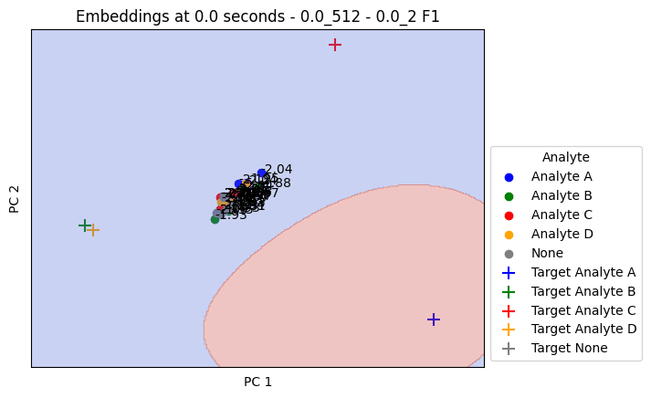
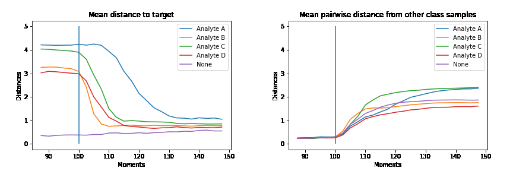

## I'm currently working on

Multimodal Large Language Models:
- Uploading code soon for adapting any image transformer and transformer language model into a multimodal-llm (MLLM)
- Train a custom adapter to link the latent representations of the two token sequences
- Potentially fine-tune with parameter-efficient fine-tuning (peft, LoRA)
- Custom training pipeline for bootstrapping text-image pairs into <text, image, text>, <text, image>, <image, text> as an augmentation
- Hosting as a Gradio or Huggingface space to demo

Chemical Sensing:
- Novel architectures for multitask learning + early classification of time series
- Optimized preprocessing
- Learning from  [Samples Worth Learning](https://arxiv.org/abs/2107.02565)

Molecular Representations:
- [VicReg](https://arxiv.org/abs/2105.04906) over molecular images for augmentation-invariant embeddings
- [Graph Transformers](https://arxiv.org/abs/2007.02835) over 3D molecular structure for unsupervised property embeddings

## I'm interested and have ongoing projects in
- Graph contrastive representation learning
- Sequential representations of time series

## Past work:
Publications and some public projects on [my page](https://alexander-moore.github.io/)

<!--
**alexander-moore/alexander-moore** is a ✨ _special_ ✨ repository because its `README.md` (this file) appears on your GitHub profile.

Here are some ideas to get you started:

- 🔭 I’m currently working on ...
- 🌱 I’m currently learning ...
- 👯 I’m looking to collaborate on ...
- 🤔 I’m looking for help with ...
- 💬 Ask me about ...
- 📫 How to reach me: ...
- 😄 Pronouns: ...
- ⚡ Fun fact: ...
-->
